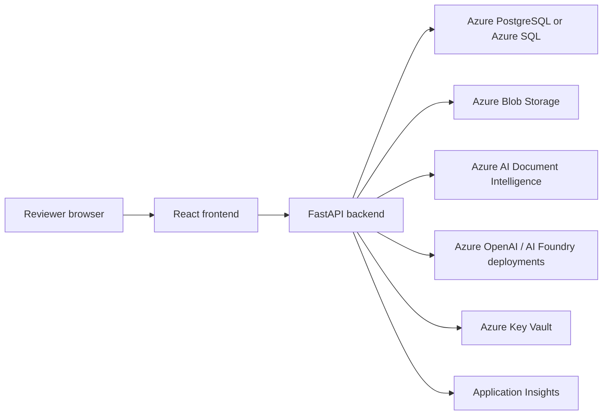

# Azure Deployment Configuration

This project is ready for Azure deployment planning, but this repository does not currently include GitHub Actions workflows. Do not deploy from this step. Use the manual checklist below or wire the same commands into the CI/CD system already approved by the institution.

## Recommended Azure Architecture

Use either Azure Container Apps or Azure App Service for the FastAPI backend. Container Apps is a good default when the team wants container-native revision management, private networking, and future background workers. App Service is also acceptable for a simpler web-app hosting model.



The system remains reviewer decision support only. No Azure component should be configured to auto-admit, auto-reject, or make binding admissions decisions.

## Azure Resources

### Compute

Choose one backend host:

- Azure Container Apps: deploy `backend/Dockerfile` as a container image from Azure Container Registry.
- Azure App Service for Containers: deploy the same backend image to a Linux Web App.

Frontend options:

- Azure Static Web Apps for the Vite build output.
- Azure App Service static hosting.
- Storage static website plus CDN, if institution policy allows it.

### Azure Blob Storage

Create a storage account and a private container:

```text
admissions-raw
```

Documents should follow the existing path pattern:

```text
applications/{application_id}/raw/{document_id}/{safe_filename}
```

Use private access, encryption at rest, lifecycle retention policies, and least-privilege access. Prefer managed identity role assignments over long-lived connection strings when the Azure storage implementation is completed.

### Azure AI Document Intelligence

Create an Azure AI Document Intelligence resource and configure:

```text
AZURE_DOCUMENT_INTELLIGENCE_ENDPOINT
AZURE_DOCUMENT_INTELLIGENCE_KEY
```

The backend is designed for `prebuilt-layout` extraction.

### Azure OpenAI / Azure AI Foundry

Create model deployments for:

- document classification
- structured extraction
- document summarization
- rubric scoring
- reviewer support, if needed later

Record the exact deployment names in production app settings:

```text
AZURE_OPENAI_CLASSIFICATION_MODEL_DEPLOYMENT
AZURE_OPENAI_STRUCTURED_EXTRACTION_MODEL_DEPLOYMENT
AZURE_OPENAI_SUMMARIZATION_MODEL_DEPLOYMENT
AZURE_OPENAI_RUBRIC_SCORING_MODEL_DEPLOYMENT
AZURE_OPENAI_REVIEW_MODEL_DEPLOYMENT
```

Keep prompt template versions immutable for auditability.

### Database

Use one managed relational database:

- Azure Database for PostgreSQL Flexible Server, recommended for SQLAlchemy/PostgreSQL compatibility.
- Azure SQL Database, acceptable if the team standardizes on SQL Server and adapts the SQLAlchemy driver and URL.

Production must not use SQLite. Store `DATABASE_URL` in Key Vault or a platform secret setting. Use SSL and private networking where feasible.

The Rubrics editor uses the same PostgreSQL database through `/api/rubrics`; saved rubrics live in `saved_rubrics`. Keep rubrics in the application database for staging and production unless a later multi-tenant isolation design splits data stores.

### Application Insights

Create an Application Insights resource and configure:

```text
APPLICATIONINSIGHTS_CONNECTION_STRING
```

Collect request telemetry, exceptions, dependencies, latency, and availability checks. Do not collect full document text, raw OCR text, secrets, API keys, or unredacted uploaded file contents in logs.

### Key Vault

Create a Key Vault for:

- database password or connection string
- Azure OpenAI API key, if managed identity is not available
- Document Intelligence key
- Storage connection string, if managed identity is not available
- Application Insights connection string
- future Azure Language key

Grant the backend managed identity `get` access to required secrets only.

## Backend Container

Build the backend image from the repository root:

```powershell
docker build -f backend/Dockerfile -t admissions-ai-backend:local .
```

Run locally with compose:

```powershell
docker compose up --build
```

Compose starts:

- `db`: PostgreSQL 16
- `backend`: FastAPI at `http://localhost:8000`
- `frontend`: Vite at `http://localhost:5173`

The compose file uses mock AI services and local file storage. It sets `AUTO_CREATE_DB_SCHEMA=true` only for local development. Keep that disabled in production.

## Production Environment Variables

Use [admissions-ai-production-env.md](./admissions-ai-production-env.md) as the production app setting checklist. Configure secrets through Key Vault references or managed identity, not checked-in files.

## Deployment Checklist

Before deploying:

- Build and push the backend image to Azure Container Registry.
- Configure managed identity for the backend compute resource.
- Grant managed identity access to Key Vault secrets.
- Grant managed identity least-privilege access to Blob Storage when supported by the storage implementation.
- Configure Key Vault secrets for database, Azure AI, OpenAI, observability, and storage credentials.
- Configure CORS to allow only the production frontend origin.
- Create the Blob Storage container and verify private access.
- Configure Document Intelligence endpoint and key.
- Configure Azure OpenAI endpoint, API version, and model deployment names.
- Configure Azure AI Foundry project endpoint and optional agent metadata.
- Create the production PostgreSQL or Azure SQL database.
- Run database migrations before switching traffic.
- Set `AUTO_CREATE_DB_SCHEMA=false` in production.
- Set `DEV_AUTH_ENABLED=false` after production identity integration is in place.
- Verify Application Insights telemetry without document content or secrets.
- Run backend tests, frontend tests, frontend build, and mock evals in CI.
- Smoke test `/health` and `/api/v1/system/config-check`.
- Confirm the UI displays decision-support safeguards and never treats AI output as a final decision.

## Database Migrations

The local MVP uses simple SQLAlchemy table creation for SQLite and optional local compose bootstrap. Production should introduce Alembic migrations before first release. The deployment gate should run migrations in a controlled job before starting the new backend revision.

## CI And Manual Deployment

No first-party `.github/workflows` directory exists in this repository, so no GitHub Actions workflow was added. If the repo later adopts GitHub Actions, add a workflow that runs the same checks below.

PowerShell CI command:

```powershell
.\scripts\ci-test.ps1
```

If local PowerShell execution policy blocks scripts:

```powershell
powershell -ExecutionPolicy Bypass -File .\scripts\ci-test.ps1
```

POSIX CI command:

```sh
sh scripts/ci-test.sh
```

Equivalent explicit steps:

```powershell
python -m pip install -r requirements.txt
python -B -m pytest backend/tests evals -p no:cacheprovider
python -m evals.run_evals
cd frontend
npm ci
npm test
npm run build
```

Manual deployment outline:

1. Run the CI commands above.
2. Build and push the backend container image.
3. Deploy infrastructure resources through the institution-approved IaC or portal process.
4. Configure environment variables and Key Vault references.
5. Run database migrations.
6. Deploy the backend revision.
7. Deploy the frontend build.
8. Smoke test health, config-check, upload, processing with mock or staging AI services, reviewer override, and final decision persistence.
